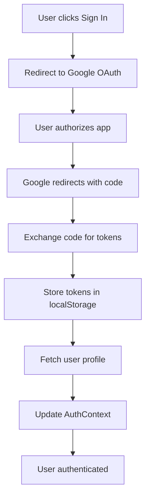
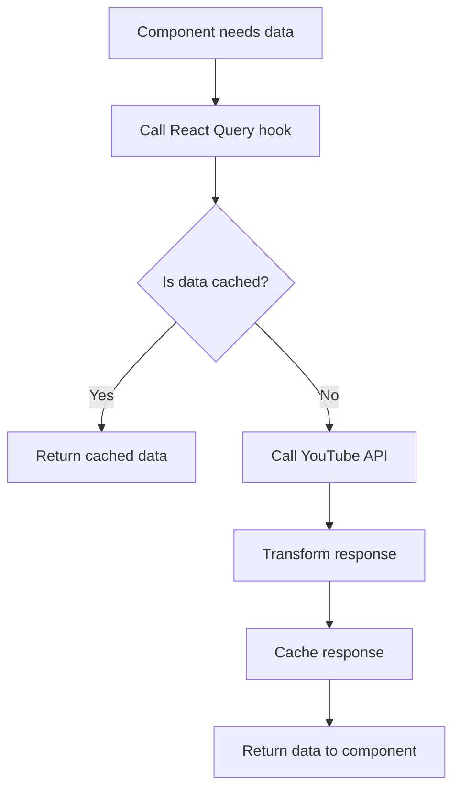

# MyTube - Architecture Documentation

## 🏗️ Project Structure

```
MyTube/
├── src/
│   ├── app/                    # Next.js App Router pages
│   │   ├── api/               # API routes
│   │   │   └── auth/google/   # OAuth endpoints
│   │   ├── auth/              # Authentication pages
│   │   ├── channel/[id]/      # Dynamic channel pages
│   │   ├── search/            # Search page
│   │   ├── subscriptions/     # Subscriptions page
│   │   ├── watch/[id]/        # Video player pages
│   │   ├── globals.css        # Global styles
│   │   ├── layout.tsx         # Root layout
│   │   ├── loading.tsx        # Global loading UI
│   │   └── page.tsx           # Home page
│   ├── components/            # Reusable UI components
│   │   ├── ChannelCard.tsx    # Channel display component
│   │   ├── ErrorBoundary.tsx  # Error handling component
│   │   ├── ErrorFallback.tsx  # Error display component
│   │   ├── Layout.tsx         # Main layout component
│   │   ├── LoadingSpinner.tsx # Loading states
│   │   ├── Providers.tsx      # React Query provider
│   │   ├── SearchBar.tsx      # Search input component
│   │   ├── Toast.tsx          # Notification system
│   │   └── VideoCard.tsx      # Video display component
│   ├── contexts/              # React contexts
│   │   └── AuthContext.tsx    # Authentication state
│   ├── hooks/                 # Custom React hooks
│   │   ├── usePerformance.ts  # Performance monitoring
│   │   └── useYouTube.ts      # YouTube API hooks
│   ├── lib/                   # Utility libraries
│   │   ├── utils.ts           # General utilities
│   │   └── youtube-api.ts     # YouTube API client
│   ├── types/                 # TypeScript definitions
│   │   └── index.ts           # Type definitions
│   └── __tests__/             # Test files
│       ├── components/        # Component tests
│       └── lib/               # Library tests
├── .env.example               # Environment variables example
├── .env.local                 # Local environment variables
├── API.md                     # API documentation
├── DEPLOYMENT.md              # Deployment guide
├── jest.config.js             # Jest configuration
├── jest.setup.js              # Jest setup file
├── next.config.js             # Next.js configuration
├── package.json               # Dependencies and scripts
├── prd.txt                    # Product Requirements Document
├── README.md                  # Main documentation
├── tailwind.config.ts         # Tailwind configuration
└── tsconfig.json              # TypeScript configuration
```

## 🔄 Data Flow Architecture

### Authentication Flow


### API Data Flow


## 🧩 Component Architecture

### Layout Hierarchy
```
RootLayout
├── ErrorBoundary
├── Providers (React Query)
├── ToastProvider
├── AuthProvider
└── Layout
    ├── Header
    │   ├── Logo
    │   ├── Navigation
    │   └── UserMenu
    ├── Sidebar
    │   └── NavigationLinks
    └── Main Content
        └── Page Components
```

### State Management
- **Global State**: React Context for authentication
- **Server State**: React Query for API data
- **Local State**: useState for component state
- **Form State**: Controlled components

## 🔌 API Integration

### YouTube Data API v3
- **Base URL**: `https://www.googleapis.com/youtube/v3`
- **Authentication**: OAuth 2.0 with access tokens
- **Rate Limiting**: Built-in retry logic
- **Caching**: In-memory cache with TTL

### Google OAuth 2.0
- **Authorization URL**: `https://accounts.google.com/o/oauth2/v2/auth`
- **Token URL**: `https://oauth2.googleapis.com/token`
- **Scope**: `https://www.googleapis.com/auth/youtube.readonly`
- **Flow**: Authorization Code with PKCE

## 🎨 UI/UX Architecture

### Design System
- **Framework**: TailwindCSS
- **Icons**: Lucide React
- **Typography**: Inter font
- **Color Scheme**: Light/Dark mode support
- **Responsive**: Mobile-first design

### Component Design Principles
- **Reusability**: Composable components
- **Accessibility**: ARIA labels and keyboard navigation
- **Performance**: Optimized images and lazy loading
- **Consistency**: Shared design tokens

## 🔒 Security Architecture

### Authentication Security
- **State Parameter**: CSRF protection
- **Token Storage**: localStorage (consider httpOnly cookies for production)
- **Token Refresh**: Automatic refresh before expiration
- **Logout**: Proper token revocation

### API Security
- **HTTPS Only**: Secure communication
- **Rate Limiting**: Built-in retry logic
- **Error Handling**: No sensitive data exposure
- **Input Validation**: Sanitized user inputs

## 📊 Performance Architecture

### Optimization Strategies
- **Image Optimization**: Next.js Image component
- **Code Splitting**: Automatic with Next.js App Router
- **Caching**: Multi-level caching strategy
- **Bundle Optimization**: Tree shaking and minification

### Performance Monitoring
- **Page Load Metrics**: Navigation timing API
- **API Performance**: Request duration tracking
- **Error Tracking**: Error boundary logging
- **User Experience**: Core Web Vitals

## 🧪 Testing Architecture

### Testing Strategy
- **Unit Tests**: Component and utility testing
- **Integration Tests**: API integration testing
- **E2E Tests**: Critical user flow testing (recommended)
- **Performance Tests**: Load and stress testing (recommended)

### Testing Tools
- **Jest**: Test runner and framework
- **React Testing Library**: Component testing
- **MSW**: API mocking (recommended)
- **Playwright**: E2E testing (recommended)

## 🚀 Deployment Architecture

### Build Process
1. **Type Checking**: TypeScript compilation
2. **Linting**: ESLint validation
3. **Testing**: Automated test execution
4. **Building**: Next.js production build
5. **Optimization**: Bundle optimization and compression

### Deployment Targets
- **Vercel**: Recommended for Next.js apps
- **Netlify**: Alternative static hosting
- **Docker**: Containerized deployment
- **Self-hosted**: Custom server deployment

## 📈 Scalability Considerations

### Performance Scaling
- **CDN**: Static asset delivery
- **Image Optimization**: Automatic format conversion
- **API Caching**: Redis for shared cache
- **Database**: User preferences and analytics

### Feature Scaling
- **Microservices**: Separate API services
- **Database**: User data persistence
- **Analytics**: User behavior tracking
- **Recommendations**: Content recommendation engine

## 🔧 Configuration Management

### Environment Configuration
- **Development**: Local `.env.local`
- **Staging**: Platform environment variables
- **Production**: Secure environment variable management

### Feature Flags
- **Environment-based**: Different features per environment
- **User-based**: A/B testing capabilities
- **Performance**: Toggle heavy features

## 📚 Technology Stack Summary

### Frontend
- **Framework**: Next.js 15 with App Router
- **Language**: TypeScript
- **Styling**: TailwindCSS
- **State Management**: React Query + Context API
- **Icons**: Lucide React
- **Date Handling**: date-fns

### Backend
- **API Routes**: Next.js API routes
- **Authentication**: Google OAuth 2.0
- **External APIs**: YouTube Data API v3

### Development
- **Testing**: Jest + React Testing Library
- **Type Checking**: TypeScript
- **Linting**: ESLint
- **Package Manager**: npm

### Deployment
- **Platform**: Vercel (recommended)
- **Build**: Next.js static generation
- **CDN**: Automatic with Vercel
- **Monitoring**: Built-in performance tracking
